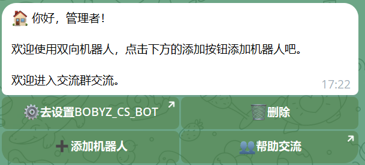
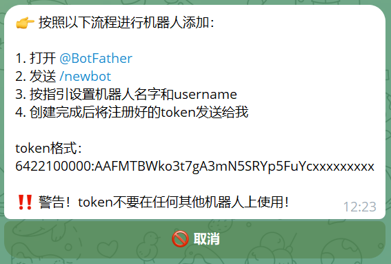
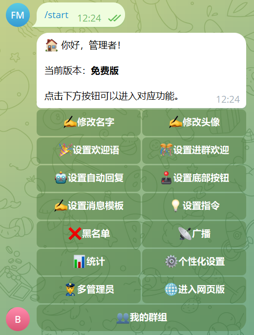
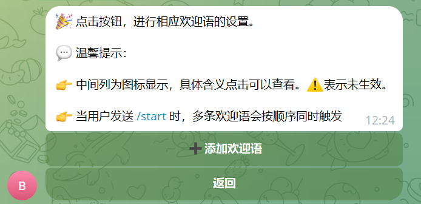
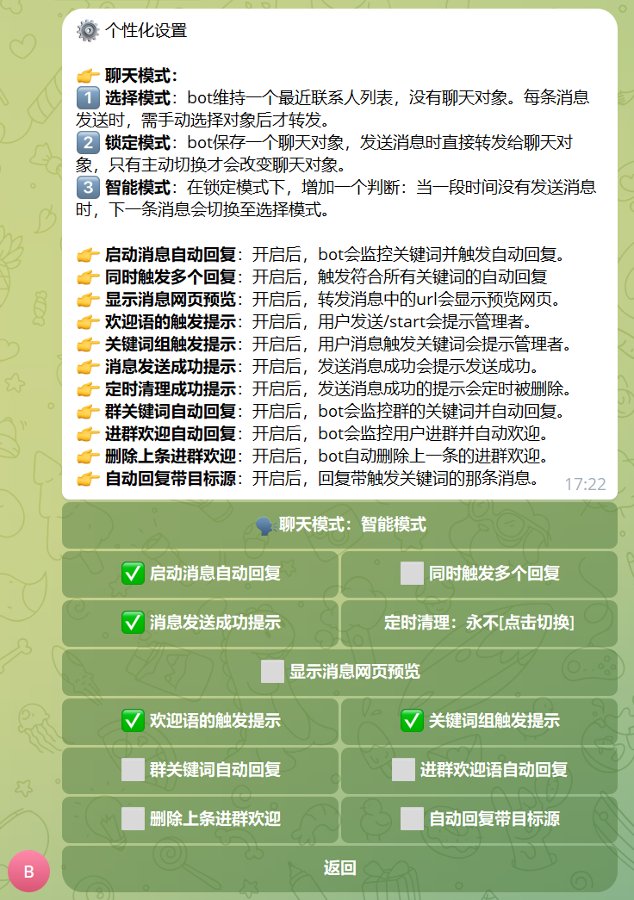
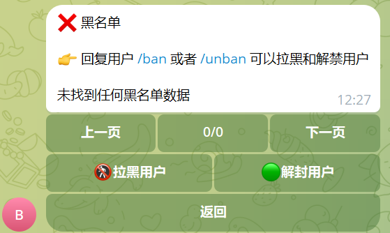

金科双向机器人系统
===============

当前最新版本： v.1.0（发布日期：2024-03-19） 

项目介绍
-----------------------------------

金科双向机器人系统 是一款基于 jeecgboot 框架开发的电报机器人系统

`宗旨是:` 实现一款灵活、强大的电报双向机器人管理系统！

遇到技术问题，[请在这里反馈BUG](https://github.com/jeecgboot/jeecg-boot/issues/new)

快速搭建开发环境
-----------------------------------

- [通过IDEA导入项目](https://help.jeecg.com/java/setup/idea.html)
- [通过IDEA启动项目](https://help.jeecg.com/java/setup/idea/startup.html)

技术支持
-----------------------------------

关闭gitee的issue通道，使用中遇到问题或者BUG可以在 [Github上提Issues](https://github.com/jeecgboot/jeecg-boot/issues/new)

技术架构：
-----------------------------------
#### 开发环境

- 语言：Java 8+ (小于17)

- IDE(JAVA)： IDEA (必须安装lombok插件 )

- 依赖管理：Maven

- 缓存：Redis

- 数据库脚本：MySQL5.7+  &  Oracle 11g & Sqlserver2017（其他数据库，[需要自己转](https://my.oschina.net/jeecg/blog/4905722)）

#### 开发框架

- 基础框架：Spring Boot 2.6.14

- 持久层框架：MybatisPlus 3.5.1

- 安全框架：Apache Shiro 1.10.0，Jwt 3.11.0

- 数据库连接池：阿里巴巴Druid 1.1.22

- 日志打印：logback

- 其他：autopoi, fastjson，poi，Swagger-ui，quartz, lombok等

#### 支持库

|  数据库   |  支持   |
| --- | --- |
|   MySQL   |  √   |
|  Oracle11g   |  √   |
|  Sqlserver2017   |  √   |
|   PostgreSQL   |  √   |
|   MariaDB   |  √   |

### 系统效果

##### PC端

