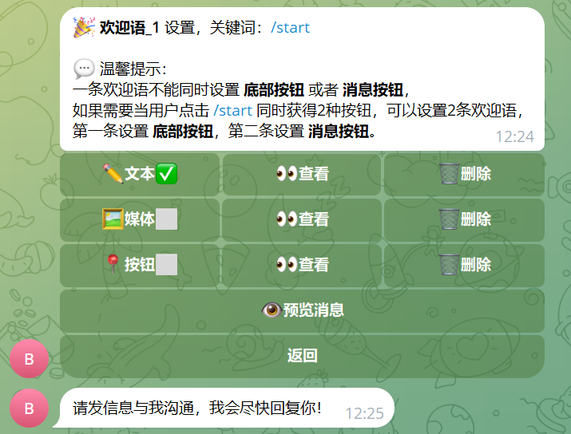

金科双向机器人系统
===============

当前最新版本： v.1.0（发布日期：2024-03-20） 

项目介绍
-----------------------------------

金科双向机器人系统 是一款基于 jeecgboot 框架开发的电报机器人系统，使用 telegrambots 库对接telegram接口。

`宗旨是:` 实现一款灵活、强大的电报双向机器人管理系统！

技术支持
-----------------------------------

使用中遇到问题或者BUG可以在 [Github上提Issues](https://github.com/tnyi/clone-bot-backend/issues/new)

作者的联系方式：
- 邮件：tnyi@live.cn
- 电报：[Frank Martinez](https://t.me/frankmartinez999)
- 电报交流群：[金科双向机器人交流群](https://t.me/GOLD_CC_group)

技术架构：
-----------------------------------
#### 开发环境

- 语言：Java 8+ (小于17)

- IDE(JAVA)： IDEA (必须安装lombok插件 )

- 依赖管理：Maven

- 缓存：Redis

- 数据库脚本：MySQL5.7+  &  Oracle 11g & Sqlserver2017

#### 开发框架

- 基础框架：Spring Boot 2.6.14

- 持久层框架：MybatisPlus 3.5.1

- 安全框架：Apache Shiro 1.10.0，Jwt 3.11.0

- 数据库连接池：阿里巴巴Druid 1.1.22

- 日志打印：logback

- 其他：autopoi, fastjson，poi，Swagger-ui，quartz, lombok等

#### 支持库

|  数据库   |  支持   |
| --- | --- |
|   MySQL   |  √   |
|  Oracle11g   |  √   |
|  Sqlserver2017   |  √   |
|   PostgreSQL   |  √   |
|   MariaDB   |  √   |

### 系统效果

##### PC端

